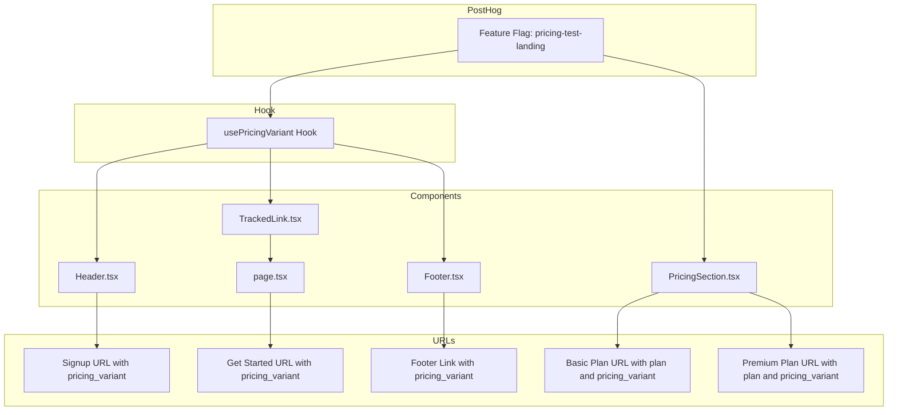

# Plan: Add pricing_variant Parameter to All CTA Links

## Overview

Add `pricing_variant` parameter (without `plan` parameter) to all general CTA links pointing to `chat.justtalk.ai` across the main home page. This ensures consistent tracking of pricing experiments across all entry points.

## Current State

### Already Implemented ✅
- [`PricingSection.tsx`](../chat-landing/components/PricingSection.tsx:84-87) - Correctly includes both `plan` and `pricing_variant` parameters:
  ```typescript
  const pricingVariant = pricingPayload?.key || 'control';
  const basicUrl = `https://chat.justtalk.ai/?plan=basic&pricing_variant=${pricingVariant}&ref=justtalk.ai`;
  const premiumUrl = `https://chat.justtalk.ai/?plan=premium&pricing_variant=${pricingVariant}&ref=justtalk.ai`;
  ```

### Needs Updates ❌

| Component | Location | Current URL | Required Change |
|-----------|----------|-------------|-----------------|
| Header.tsx | Line 18-21 | `https://chat.justtalk.ai/welcome?ref=justtalk.ai` | Add `pricing_variant` |
| Header.tsx | Line 74, 81 | Same signup URL | Add `pricing_variant` |
| page.tsx | Line 57 | `https://chat.justtalk.ai/welcome?ref=justtalk.ai` | Add `pricing_variant` |
| Footer.tsx | Line 30 | `https://chat.justtalk.ai/welcome?ref=justtalk.ai` | Add `pricing_variant` |

## Implementation Plan

### Step 1: Create a Reusable Hook for Pricing Variant

Create a new hook `usePricingVariant` that centralizes the logic for fetching the pricing variant from PostHog.

**File:** `chat-landing/hooks/usePricingVariant.ts`

```typescript
'use client';

import { useFeatureFlagPayload } from 'posthog-js/react';
import posthog from 'posthog-js';
import { useEffect } from 'react';

interface PricingPayload {
  key: string;
  basic_monthly: string;
  basic_annual: string;
  premium_monthly: string;
  premium_annual: string;
}

export function usePricingVariant(): string {
  const pricingPayload = useFeatureFlagPayload('pricing-test-landing') as PricingPayload | undefined;
  
  // Trigger feature flag evaluation
  useEffect(() => {
    if (typeof window !== 'undefined') {
      posthog.isFeatureEnabled('pricing-test-landing');
    }
  }, []);
  
  return pricingPayload?.key || 'control';
}
```

### Step 2: Update Header.tsx

**Changes Required:**
1. Import the new `usePricingVariant` hook
2. Get the pricing variant value
3. Append `pricing_variant` parameter to signup URLs

**Updated URLs:**
```typescript
// Before
const signupUrl = 'https://chat.justtalk.ai/welcome?ref=justtalk.ai';

// After
const pricingVariant = usePricingVariant();
const signupUrl = `https://chat.justtalk.ai/welcome?pricing_variant=${pricingVariant}&ref=justtalk.ai`;
```

### Step 3: Update page.tsx

**Changes Required:**
1. The component is currently a Server Component (no 'use client')
2. Options:
   - Option A: Make it a Client Component and use the hook directly
   - Option B: Create a wrapper Client Component for the CTA section
   - Option C: Use a separate TrackedLink component that handles pricing variant internally

**Recommended: Option C** - Enhance `TrackedLink` component to optionally append pricing variant

### Step 4: Update TrackedLink.tsx

Enhance the `TrackedLink` component to support automatic pricing variant injection:

```typescript
interface TrackedLinkProps {
  href: string;
  eventName: string;
  eventProperties?: Record<string, unknown>;
  children: ReactNode;
  className?: string;
  target?: string;
  rel?: string;
  includePricingVariant?: boolean; // New prop
}
```

### Step 5: Update Footer.tsx

**Changes Required:**
1. Import the `usePricingVariant` hook
2. Get the pricing variant value
3. Append `pricing_variant` parameter to the JustTalk AI link

## Architecture Diagram



## Files to Modify

| File | Type | Changes |
|------|------|---------|
| `chat-landing/hooks/usePricingVariant.ts` | New | Create reusable hook |
| `chat-landing/components/Header.tsx` | Modify | Use hook, update URLs |
| `chat-landing/components/Footer.tsx` | Modify | Use hook, update URL |
| `chat-landing/components/TrackedLink.tsx` | Modify | Add pricing variant support |
| `chat-landing/app/page.tsx` | Modify | Use enhanced TrackedLink |

## Testing Checklist

- [ ] Verify pricing_variant is correctly appended to Header signup URLs
- [ ] Verify pricing_variant is correctly appended to Hero Get Started URL
- [ ] Verify pricing_variant is correctly appended to Footer JustTalk AI link
- [ ] Verify PricingSection URLs remain unchanged (plan + pricing_variant)
- [ ] Test with different PostHog feature flag values
- [ ] Test fallback to 'control' when feature flag is not available

## Notes

- The `plan` parameter is only included in PricingSection URLs where a specific plan is selected
- General CTAs only include `pricing_variant` for tracking purposes
- The `ref=justtalk.ai` parameter is preserved in all URLs
